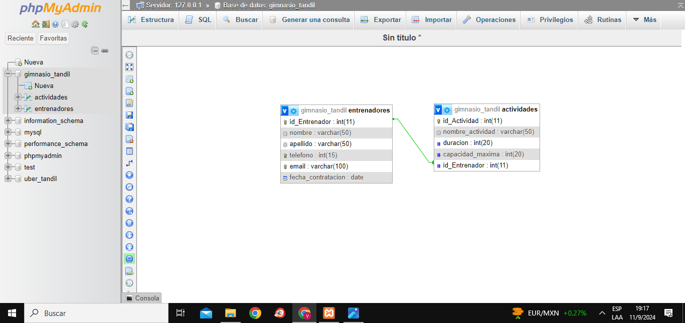

# Gimnasio_web2

## Integrantes:

* Cantero Gomez, Pablo Eduardo.
* Flores Depietri, Victoria.

## Descripción

El sistema es una API REST diseñada para la gestión de actividades en un entorno basado en el patrón MVC (Modelo-Vista-Controlador). Proporcionando endpoints bien definidos para interactuar con los datos.

## Endpoints

* GET /api/actividades
Devuelve todos los boletos disponibles en la base de datos, permitiendo opcionalmente aplicar ordenamiento a los resultados.

    -Ordenamiento

## DER

